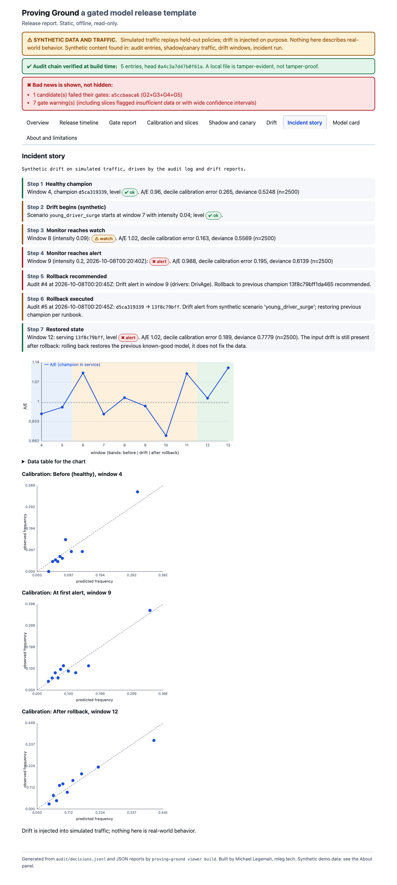

# Proving Ground: a gated model release template

**Ship a model only when the evidence says so.** Proving Ground is a template repository for releasing a model through
explicit, config-driven **gates**, a **shadow then canary** stage, **drift monitoring**, a **hash-chained audit log**, and a
**tested one-command rollback**. It ships with a worked example (a motor-insurance claim-frequency model) and a
**static report viewer** that turns the release evidence into one offline HTML page.

- **Live sample report:** published from CI to GitHub Pages (upstream repo only) once the repo is public, see [publish-sample-report.yml](.github/workflows/publish-sample-report.yml). The page carries a "Generated from synthetic demo data" banner.
- **Fork it, swap in your model:** five touchpoints, see [TEMPLATE_GUIDE.md](TEMPLATE_GUIDE.md).
- Built by [Michael Legemah](https://mleg.tech/?utm_source=github&utm_medium=template&utm_campaign=proving-ground).



## Decisions (Phase 0)

| Question | Decision | Status |
|---|---|---|
| License | **MIT** | decided |
| Python | Developed and tested on **3.14**; supports **3.11+** (CI runs 3.11 and 3.14) | decided; versions pinned in `requirements.lock` |
| Dataset | `freMTPL2freq` from OpenML (data id 41214), **fetched at setup, never committed**. OpenML lists it as CC0, but the original CASdatasets distribution is GPL, so redistribution rights are treated as unsettled. Checksum-verified (md5 `f8875568…`) | decided |
| No timestamps | The dataset has no date column: **policy- and risk-profile-grouped split, no time split**, stated in every artifact | decided |
| Offline claim | Needs network **once** (36 MB download). After that, fully offline. `make data-synthetic` gives a labeled-synthetic stand-in with no network at all (used by CI) | decided |
| Sensitive features | Driver age and region are **kept**, reported by slice, proxy risk stated in the model card | decided |
| Recalibration | A scale factor fitted on the validation split is **part of the candidate** and its hash; gates run on the recalibrated predictions | decided |
| Name availability | `proving-ground` and `proving_ground` are **free on PyPI**; an unrelated `proving-ground` exists on npm (irrelevant unless an npm package is added); a GitHub search for MLOps tools with this name found nothing. **Not done: GitHub org/repo availability in your chosen account, trademark search** | **open: you** |
| Repo home | Personal account vs org | **open: you** |
| Tracking | File registry is the source of truth; MLflow (local SQLite) is an **opt-in mirror** (`tracking: mlflow`) | decided |

## Run the full demo

```bash
make setup        # venv + dependencies (macOS and LightGBM: brew install libomp first)
make data         # one-time download + clean (≈36 MB). Skip with `make data-synthetic` to stay fully offline
make demo         # train → gate → shadow → canary → promote → drift → rollback → report viewer
open reports/viewer/index.html

make setup-dev && make test   # optional: 57 tests (the claims and viewer tests run a shortened demo on synthetic data)
```

**Measured runtime:** 1.4 minutes (84 s) for `make demo` on an Apple-silicon Mac, Python 3.14, data already fetched. The
download adds a few seconds on a normal connection. `make demo-fast` (synthetic stand-in, used by CI) takes ≈25 s. The
spec's 15-minute budget is therefore comfortable; slower machines should still land well inside it.

## What the demo shows

1. Trains a **constant baseline, a Poisson GLM and LightGBM** (cross-validated tuning inside the training split only).
2. The GLM passes gates **G1–G8** and becomes champion (G3 is skipped, and the skip is recorded, because there is no champion yet).
3. A **degraded challenger** (preprocessing bug) is **rejected** by named gates (G2, G3, G4, G5) and the rejection is audited.
4. LightGBM passes the gates, then **shadow** and a **10% canary** (stable-hash routing), and is promoted.
5. **Synthetic drift** (`young_driver_surge`) is injected into simulated traffic. The monitor moves `ok → watch → alert`, writes a
   **rollback recommendation** to the audit log, `rollback` restores the previous champion (verified via `GET /health`), and a second
   rollback call is a no-op.
6. Runs **all nine drift scenarios** against their declared expectations and lists any misses.
7. Verifies the **audit chain** and builds the **report viewer**.

| Constant vs GLM vs LightGBM on one grouped holdout (102,035 policies, exposure-weighted, 95% bootstrap CIs) | Poisson deviance | Gini |
|---|---|---|
| Constant baseline | 0.6237 [0.612, 0.636] | 0 |
| Poisson GLM | 0.5774 [0.567, 0.590] | 0.328 [0.314, 0.344] |
| LightGBM | 0.5528 [0.542, 0.565] | 0.378 [0.364, 0.394] |

The headline incident is written up in [docs/companion/blog-post-draft.md](docs/companion/blog-post-draft.md).

## Adopt it for your model

1. Implement `ModelProject` ([interface.py](src/proving_ground/interface.py)).
2. Point `config/project.yaml` at it.
3. Put your data under DVC (`dvc.yaml`).
4. Set thresholds in `config/gates.yaml` (after you have baseline results, not before).
5. Edit the model card template in your project's `render_model_card`.

Details and a worked toy example: [TEMPLATE_GUIDE.md](TEMPLATE_GUIDE.md) and [examples/toy/](examples/toy/).

## Invariants this repo enforces (tests in `tests/`)

No promotion without a passing gate report for that exact candidate (no `--force`) · gates are config and their hash is recorded ·
append-only hash-chained audit log, tamper-**evident** not tamper-proof · rollback exercised in CI · reproducible candidate hashes ·
synthetic data and traffic always labeled · exposure respected and tested · no policy id (or risk profile) in two splits · holdout
evaluated once per candidate · no secrets needed · nothing in `src/proving_ground` imports `examples/` · the viewer is read-only,
offline, escapes all input and ships a CSP.

## Limitations (specific, not boilerplate)

- **No timestamps.** Temporal generalization, seasonality and trend were **not evaluated**. The holdout is one random grouped split.
- **Simulated traffic.** "Production" replays held-out policies in random order. Shadow and canary demonstrate the machinery, not production.
- **Synthetic drift.** The incident is injected. Detection thresholds were chosen by the author and are sensitive to window size
  (2,500 requests per window here); see [docs/MONITORING.md](docs/MONITORING.md) for what small windows cannot see.
- **Exposure is not proportional to claims in this data.** Short-term policies have far higher claim frequency per exposure-year,
  so `Exposure` is also a covariate. This is a pragmatic fix, documented in [examples/claims_frequency/docs/FEATURES.md](examples/claims_frequency/docs/FEATURES.md), not a pricing-grade treatment.
- **Frequency only.** No severity, so nothing here estimates expected loss. Not for pricing, underwriting or reserving.
- **Fairness and compliance are not claimed.** Driver age and region can proxy for protected characteristics.
- **The audit log is a local file.** Anyone who can rewrite the whole file can recompute the chain. Anchor the head hash in CI artifacts or signed commits if that matters.
- **Pickled models.** The registry pickles models; only load registries you created (see [SECURITY.md](SECURITY.md)).
- **Not run yet:** the GitHub Actions workflows were written and their steps were run locally, but they have not executed on GitHub.
- **Maintenance:** best-effort, no SLA. Issues and PRs welcome.

## Layout

```
src/proving_ground/   template core (gates, registry, promote, rollback, serving, monitoring, audit, viewer)
examples/toy/         trivial ModelProject for the template's own tests
examples/claims_frequency/   the worked example
config/               project.yaml, gates.yaml, monitoring.yaml, release.yaml
docs/                 ARCHITECTURE, GATES, RUNBOOK, MONITORING, FAQ, companion drafts
tests/                core, claims, viewer
```

More: [docs/ARCHITECTURE.md](docs/ARCHITECTURE.md) · [docs/GATES.md](docs/GATES.md) · [docs/RUNBOOK.md](docs/RUNBOOK.md) · [docs/MONITORING.md](docs/MONITORING.md) · [docs/FAQ.md](docs/FAQ.md) · [Release readiness checklist](docs/RELEASE_READINESS_CHECKLIST.md)

---
[mleg.tech](https://mleg.tech/?utm_source=github&utm_medium=template&utm_campaign=proving-ground) · MIT licensed
