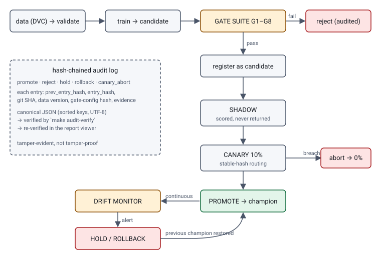

# Architecture

## Modules (`src/proving_ground`)

| Module | Job |
|---|---|
| `interface.py` | `ModelProject` protocol, `DataBundle`, `SliceSpec` |
| `candidate.py` | trains a candidate and computes its **hash** |
| `evaluation.py` | the single, cached holdout evaluation per candidate (+ ledger) |
| `gates/` | G1–G8; `runner.py` produces the JSON + markdown gate report |
| `registry.py` | file registry: models, aliases (`candidate`, `champion`, `previous_champion`), release stage |
| `promote.py` | register → shadow → canary → promote, with guards; shadow/canary evaluation |
| `rollback.py` | alias flip + hot reload + health verification; idempotent |
| `serving/app.py` | FastAPI: `/predict`, `/health`, `/metrics`, `/admin/reload`, `/admin/fault` |
| `traffic.py` | simulated traffic (always `synthetic: true`), delayed labels |
| `monitoring/` | drift statistics, windowed monitor, scenario injection, scenario matrix |
| `audit.py`, `canonical.py` | hash-chained log and its canonical serialization |
| `incident.py` | assembles before/during/after evidence |
| `viewer/` | static report viewer |
| `tracking.py` | opt-in MLflow mirror |

Nothing here imports `examples/` (enforced by `tests/core/test_structure.py`).

## Candidate hash
SHA-256 (first 16 hex chars) over the canonical JSON of `{project, family, params, seed, data_version, fingerprint}`, where
`fingerprint` hashes the candidate's predictions (6 decimals) on the first 1000 reference rows. Pickle bytes are not hashed
(not stable across versions). G7 retrains with the same seed and requires the same hash, or metrics within a declared epsilon.

## Audit log: canonical serialization
`entry_hash = sha256(canonical(entry without entry_hash))`, `prev_entry_hash` of entry 1 is 64 zeros.
Canonical = JSON with **sorted keys, separators `,` and `:`, UTF-8, non-ASCII emitted as-is, no floats** (format numbers as strings).
Python (`canonical.py`) and the viewer's JavaScript implement the same rules, and a test checks both produce the same hashes.
A local file is tamper-**evident**, not tamper-**proof**: someone who can rewrite the whole file can recompute the chain.
Tail truncation is detectable only if you remember the head hash, so anchor it somewhere (CI artifact, signed commit).
Never read the log with `splitlines()`: U+2028 inside a JSON string would split an entry (a hostile-input test caught this once).

## Release stages
`none → registered → shadow → shadow_passed → canary → canary_passed → stable` (or `aborted`).
`promote` requires `canary_passed`, except the **bootstrap** promotion when no champion exists (G3 is skipped and the audit reason says so).
Every transition re-checks the gate report: it must exist, pass, name this candidate hash and data version, and carry the **current**
`gates.yaml` hash. There is no force flag.

## Serving
- Requests are validated with the project's Pandera schema; invalid records get a structured error, are counted and logged (and are a monitor signal).
- Routing by `sha256(key)` bucket: same key, same route, across processes.
- Shadow: champion answers, candidate logged. Canary: candidate answers for `bucket < pct`; a candidate exception falls back to the champion's answer and counts as an error.
- Rollback hot-reloads via `POST /admin/reload` (local-only, `X-Admin-Token`) and verifies the restored hash via `GET /health`. No image redeploy.
- Demo and tests use an in-process client; `make serve` runs the same app under uvicorn.

## Report viewer
`make viewer` renders `reports/viewer/index.html` from JSON reports and the audit log. Python renders everything, including inline SVG charts
(`viewer/svg.py`); JavaScript only adds tabs, sorting and the optional in-browser chain verification. Deterministic, offline, escaped, CSP with script hash.
It reads only JSON (never Evidently HTML, which is linked); every report has a `schema_version` and an unsupported major version fails the build.

## Deviations from the spec
- The registry is **file-based**, with MLflow as an opt-in mirror (not the registry itself): rollback is a two-field file edit and the demo needs no database.
- `ModelProject` has four extra methods (see TEMPLATE_GUIDE.md).
- LightGBM TreeSHAP comes from `pred_contrib` (the same algorithm) rather than the `shap` package.
- G7 re-reads the holdout only when the retrained hash differs (to compare metrics); otherwise the holdout is touched once.
